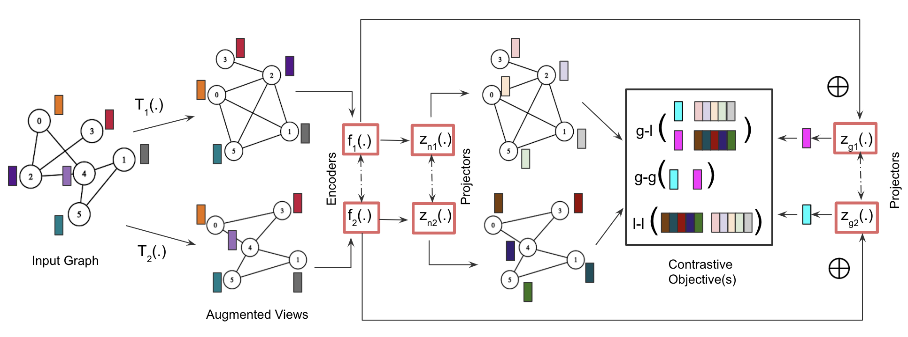
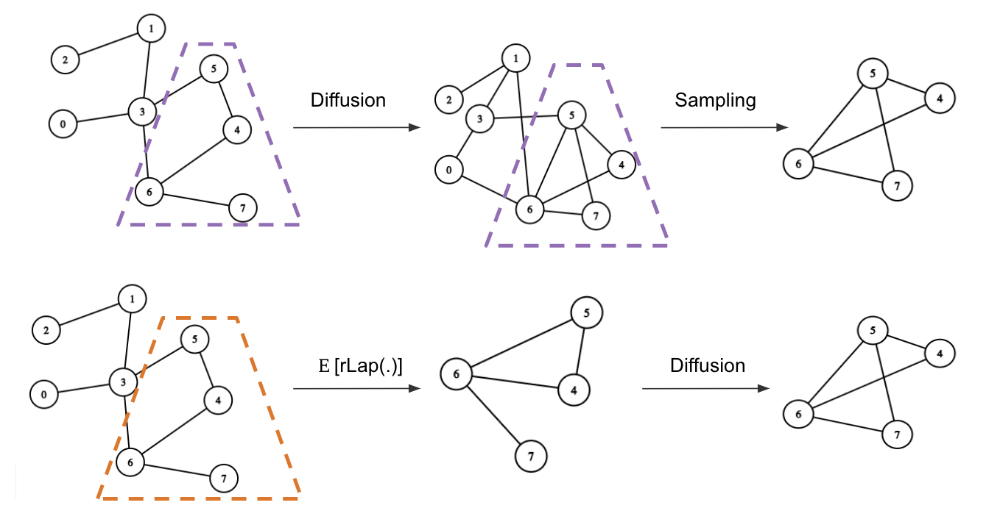

## Randomized Schur Complement Views for Graph Contrastive Learning

This work introduces a randomized topological augmentor based on Schur complements for Graph Contrastive Learning (GCL). The `rLap` augmentor is written in C++ (with Python bindings) and uses [Eigen](https://eigen.tuxfamily.org/index.php?title=Main_Page) for representing sparse matrices which aids in efficient traversal and indexing into matrices. Additionally, the relevant data structures for sampling edges are inspired from the [Laplacians.jl](https://github.com/danspielman/Laplacians.jl) effort.


<div align="center">
  
  <p align="center"> <b>Generalized GCL framework.</b> The augmentor is effective for GCL with varying design choices of encoders and objectives.</p>
</div>


_The motivation and methodology behind `rLap` is presented in my [ICML 2023](https://arxiv.org/abs/2306.04004) paper._

## Citation


```bibtex
@inproceedings{Kothapalli2023RandomizedSC,
  title={Randomized Schur Complement Views for Graph Contrastive Learning},
  author={Vignesh Kothapalli},
  booktitle={International Conference on Machine Learning},
  year={2023}
}
```


## Setup

```bash
# create virtual environment
$ python3.9 -m virtualenv .venv
$ source .venv/bin/activate

# install torch and torch-geometric if not present
$ pip install torch torch-geometric

# install rlap
$ pip install .
```

## Usage

The `rlap` API exposes a simple torch operation to obtain the randomized schur complement of a graph. A simple example is shown below:

```py
import torch
from torch_geometric.utils import barabasi_albert_graph, to_undirected
import rlap

num_nodes = 100
# prepare a sample graph
edge_index = barabasi_albert_graph(num_nodes=num_nodes, num_edges=num_nodes//2)

# ensure the graph is undirected
edge_index = to_undirected(edge_index=edge_index, num_nodes=num_nodes)

# add unit weights to the edges if not present in your graph.
edge_weights = torch.ones((1, edge_index.shape[1])).to(edge_index.device)

# concatenate to prepare the edge info
edge_info = torch.concat((edge_index, edge_weights), dim=0).t()

# compute the randomized schur complement
sc_edge_info = rlap.ops.approximate_cholesky(
    edge_info=edge_info,
    num_nodes=num_nodes,
    num_remove=50, # number of nodes to eliminate
    o_v="random", # choose from ["random", "degree", "coarsen"]
    o_n="asc", # choose from ["asc", "desc", "random"]
)

# obtain the edge_index
sc_edge_index = (torch.Tensor(sc_edge_info[:, :2]).long().t().to(edge_index.device))

# obtain the edge_weights (if necessary)
sc_edge_weights = torch.Tensor(sc_edge_info[:,-1]).t().to(edge_index.device)
```

### Benchmarks

The pytorch geometric implementation of the augmentor is based on the [PyGCL](https://github.com/PyGCL/PyGCL) library for reproducible experiments and is available in `augmentor_benchmarks.py`. Additionally, a DGL implementation is made available in `CCA-SSG/aug.py`.

To run the following scripts, change the directory to:

```bash
$ cd scripts
```

Use the following shell script to benchmark all the augmentors on node and graph classification datasets

```bash
$ bash run_augmentor_benchmarks.sh
```

Use the following python script to prepare the latex table of benchmark results. The table will be properly filled only when CPU and GPU based benchmarks have completed. _Interrupting the previous script to generate the table will lead to parsing errors for incomplete runs._

```bash
$ python prepare_augmentor_stats.py
```


### Node and graph classification experiments

Use the following shell script to run **node classification** experiments using the **GRACE** design

```bash
$ bash run_node_shared.sh
```

Use the following shell script to run **node classification** experiments using the **MVGRL** design

```bash
$ bash run_node_dedicated.sh
```

Use the following shell script to run **graph classification** experiments using the **GraphCL** design

```bash
$ bash run_graph_shared.sh
```

Use the following shell script to run **graph classification** experiments using the **BGRL (g-l)** design

```bash
$ bash run_graph_shared_g2l.sh
```

Use the following python script to prepare the latex table of results

```bash
$ python prepare_final_stats.py
```


### Additional experiments

Use the following shell script to run max singular value and edge count analysis of rlap variants

<div align="center">
  
  <p align="center"> Applying <b>rLap</b> follwed by Diffusion is equivalent in expectation to Diffusion and sub-sampling  </p>
</div>

```bash
$ python rlap_vc_spectral.py
```

Use the following shell script to plot edge counts of randomized schur complements after diffusion


```bash
$ python rlap_ppr_edge_plots.py
```

## Contributing

Please feel free to open [issues](https://github.com/kvignesh1420/rlap/issues) and create [pull requests](https://github.com/kvignesh1420/rlap/pulls) to fix bugs and improve performance.

## License

[MIT](LICENSE)